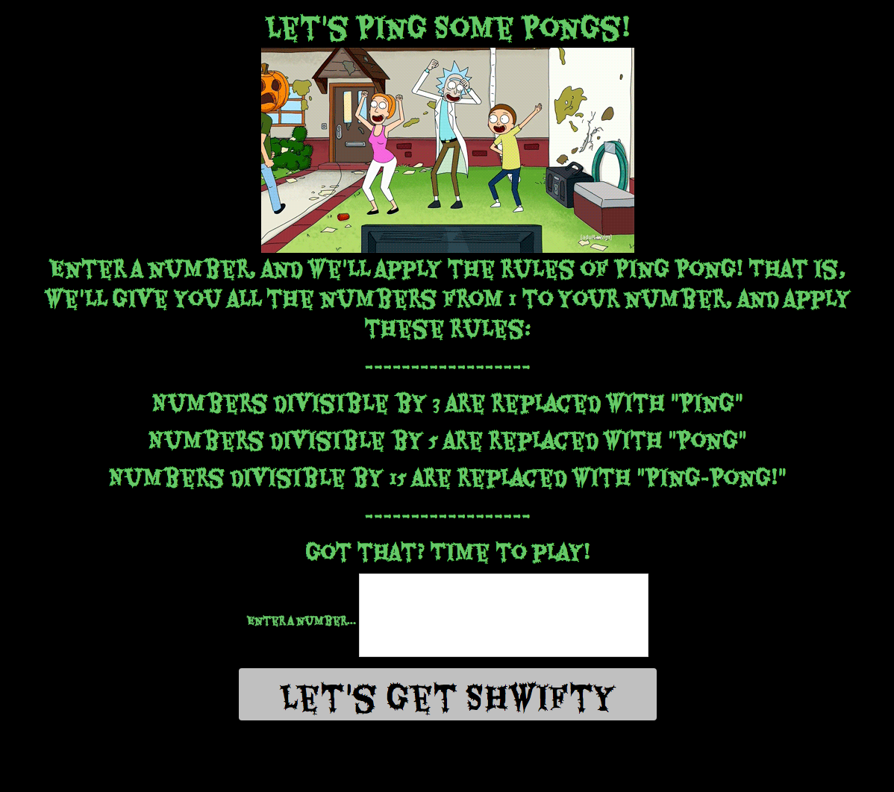

# _Ping Pong_

#### _A webpage centered around the interactive game of "ping pong"._

#### By _**Adam Craig**_

## Description

_A webpage where the user inputs a number and is returned a set of numbers between 1 and their number, with certain numbers replaced by "ping", "pong" or "ping-pong" according to a set of criteria. It uses HTML, CSS, Bootstrap, JavaScript and jQuery for content, styling and interactivity/logic._

## Setup/Installation Requirements

* _Viewing the page is easily accomplished by heading over to its GitHub Pages link at http://adamcraig.github.io/ping-pong _

## Known Bugs

_No known bugs at this time._

## Support and contact details

_For all issues and support, please contact Adam Craig at ajcraig@suffolk.edu._

## Technologies Used

_HTML, CSS, Bootstrap, JavaScript, jQuery_

##GitHub Pages Link

_http://adamcraig.github.io/ping-pong_

### License

_The MIT License (MIT)

Copyright (c) [2016] [Adam Craig]

Permission is hereby granted, free of charge, to any person obtaining a copy
of this software and associated documentation files (the "Software"), to deal
in the Software without restriction, including without limitation the rights
to use, copy, modify, merge, publish, distribute, sublicense, and/or sell
copies of the Software, and to permit persons to whom the Software is
furnished to do so, subject to the following conditions:

The above copyright notice and this permission notice shall be included in all
copies or substantial portions of the Software.

THE SOFTWARE IS PROVIDED "AS IS", WITHOUT WARRANTY OF ANY KIND, EXPRESS OR
IMPLIED, INCLUDING BUT NOT LIMITED TO THE WARRANTIES OF MERCHANTABILITY,
FITNESS FOR A PARTICULAR PURPOSE AND NONINFRINGEMENT. IN NO EVENT SHALL THE
AUTHORS OR COPYRIGHT HOLDERS BE LIABLE FOR ANY CLAIM, DAMAGES OR OTHER
LIABILITY, WHETHER IN AN ACTION OF CONTRACT, TORT OR OTHERWISE, ARISING FROM,
OUT OF OR IN CONNECTION WITH THE SOFTWARE OR THE USE OR OTHER DEALINGS IN THE
SOFTWARE._
